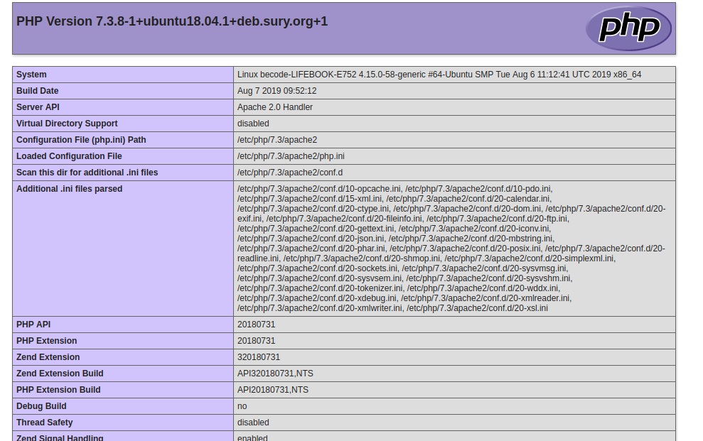
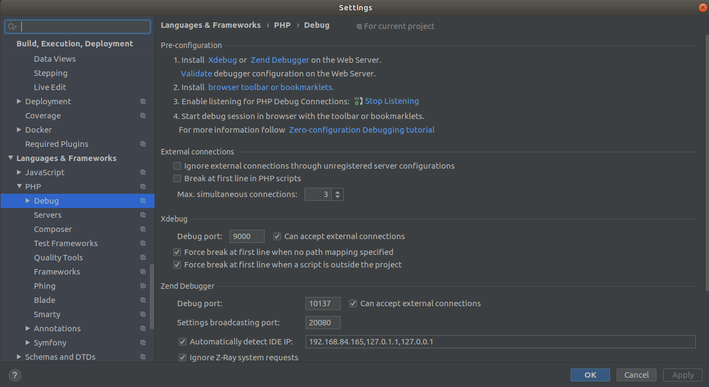
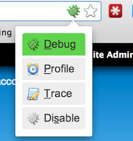
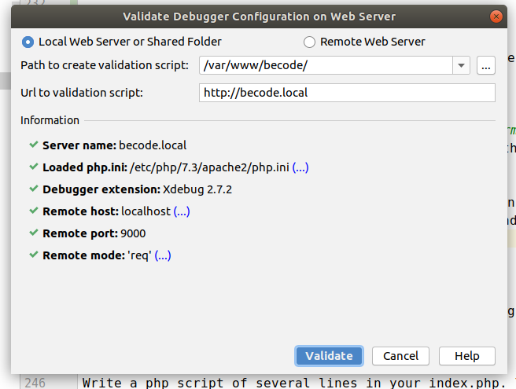
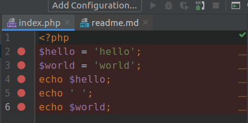
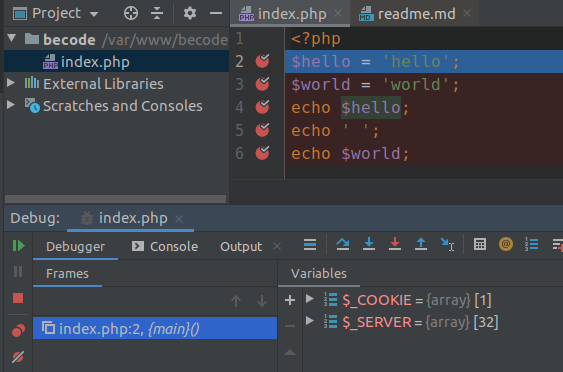

# Title: Install Apache, PHP and MySQL

- Duration: `1 day`
- Deployment strategy : Own PC
- Team challenge : `solo`

## Learning objectives
- To be able to install Apache, PHP & MySQL
- Be able to explain the different components in a webstack
- Gain more insight into the different ways to manage packages on Ubuntu.
- Learn how to create a vhost
- Learn to setup xdebug

## The Mission
Before we can start backend development we need to install a server to run our code on (Apache), a programming language to handle the backend requests (PHP) and a database to store your data (MySQL) .

We will also configure a vhost to map a domain name with your local files, and install a debugger for PHP: Xdebug.

### Install a Web Server
In this step, we will install a web server. You can choose between Apache or Nginx because both are fast, secure, and reliable. In this tutorial, we will use Apache which is the most popular among web servers.

To install Apache web server, run the following command on your server:

`sudo apt install apache2`

After installing Apache2, use the command below to start the Apache service:

`sudo systemctl start apache2`

Also, you can enable Apache server to always startup when the server boots up:

`sudo systemctl enable apache2`

You can always check the status of the Apache web service with this command:

`sudo systemctl status apache2`

You can also open your favorite browser and enter your IP address (for example http://localhost or 127.0.0.1), and check whether Apache is running on your server.
If you see the Apache’s default welcome page it means that the Apache web server is successfully installed and running.

### Subscribe to Ondřej Surý’s PHP repository
#### Some background in apt-get or apt
The way apt or apt-get work can be compared to the workings of a phone book. You enter a package name to install and it's going to look at every page of his phone book if there is a match between the package name and a precompiled installer. If the tool gets a match it will download and install the package automatically.

These tools come with a default "phone book" (repositories) of well trusted sources. You can add extra repositories to have extra locations to search in.

You can compare this to adding extra pages to your phonebook.

What it also will do is check if there are dependencies. Packages that require other packages, which on their turn can require other packages. You do not have to care about this yourself, but this can explain why sometimes installing a simple small tool can require a lot of extra space on your hard drive.

A volunteer of the PHP community (Ondřej Surý) offers an extra repository for precompiled php related packages for many different PHP versions.
We will subscribe to his repository to get access to these packages.

#### Tip
If you want a more graphical interface to install packages I recommend installing [aptitude](https://en.wikipedia.org/wiki/Aptitude_%28software%29).

#### Let's go!
We will use the Ondřej Surý’s PPA to install PHP 7.4 version, so install the software-properties-common and python-software-properties packages:

`sudo apt install software-properties-common`

After the installation is complete, add the Ondřej PPA:

`sudo LC_ALL=C.UTF-8 add-apt-repository ppa:ondrej/php`

and then update your sources:

`sudo apt update`

#### Difference between apt and apt-get
Apt is a newer program since Ubuntu 16 that offers a subset of apt-get and apt-cache commands. 

It bundles the most used apt-get and apt-cache commands in one tool with less confusing and rarely used options.

While apt-get gives more advanced options to use, by its nature it is more dangerous for your system if you make a mistake.

#### Want to know the difference between update & upgrade?
`Apt-get update` updates the list of available packages and their versions, but it does not install or upgrade any packages. 

`Apt-get upgrade` actually installs newer versions of the packages you have. 

After updating the lists, the package manager knows about available updates for the software you have installed.

### Install PHP 7.4
We can install PHP 7.4 with the following command:

`sudo apt install php7.4 php7.4-cli`
This installs the latest PHP version and a command line interface (CLI) for PHP.

PHP comes with various extension to add functionality, for example to make images or videos, to talk to different database and many more. We will now install the most common ones:
`sudo apt install php7.4-common`

We are also going to install some database specific drivers that you will need for later 

`sudo apt install php7.4-pdo`

`sudo apt install php-mysql`

To check if PHP 7.4 is installed on your server, use the command below:

`php -v`

## Check if PHP can communicate with Apache
Create a file in /var/www/html/ called index.php.
This is the location where you will have to create all your PHP enabled projects from now on.
 
Put the following code inside the index.php file:
```php
<?php
//index.php
echo phpinfo(); 
```
You should now be able to go to http://localhost/ and see an output comparable with the following image (will not match exactly):


If you do not see this output but instead clear text, but you can run `php -v` this probably means that the PHP extension was not enabled in Apache.

You can active it with running

`sudo apt-get install libapache2-mod-php`

### Lets make a vhost
Virtual hosting is a method for hosting multiple domain names (with separate handling of each name) on a single server (or pool of servers). This allows one server to share its resources, such as memory and processor cycles, without requiring all services provided to use the same host name. 

More simply put, you make a connection between a domain name and a location on your server/computer. 

For example, configure the domain name becode.local to go to /var/www/becode/index.html.
In fact, lets configure that right now together!

#### The host file
You do not need to buy a domain name to make this work locally, because you your `/etc/hosts` file overwrites your DNS server. You can manually enter domain names here to reroute them on your computer. We will redirect our custom domain names to our local IP address 127.0.0.1, where Apache will catch them.

Add the following line in `/etc/hosts`:

`127.0.0.1       becode.local`

If this was a real domain name you would skip this step and instead configure DNS settings. 

#### The vhost configuration for Apache
To copy the default configuration file run

`sudo cp /etc/apache2/sites-available/000-default.conf /etc/apache2/sites-available/becode.local.conf`

The convention is the name your file after your domain name, so in our example: becode.local
.local is often used as a "test" LTD.

Now open `/etc/apache2/sites-available/becode.local.conf` and enter the following content:

```
<VirtualHost *:80>
    DocumentRoot "/var/www/becode/"
    ServerName becode.local
</VirtualHost>
```

**Create the /var/www/becode/ directory and create an index.php with some random text inside it!**

While the vhost is now configured, you still have to enable it.

To enable or disable a site hosted with Apache, you can use the 'a2ensite' and 'a2dissite' commands, respectively. Both commands use essentially the same syntax:

* Enable: `sudo a2ensite becode.local`
* Disable: `sudo a2dissite becode.local`

Be sure to enable the vhost!

After making a change in a vhost you have to reload the server:

`sudo systemctl reload apache2`

#### Access denied?
If you get some type of Access denied error you probably have a problem with your permission settings.

Run the following command

`sudo chmod -R 755 /var/www/html/`
OR
`sudo chown -R USERNAME:GROUPNAME /var/www/html/`

**Attention:** While many posts on the internet might tell you to chmod to 777 (meaning everybody can do anything with any file) this is very bad advice! 

You create [a massive security risk](https://askubuntu.com/questions/20105/why-shouldnt-var-www-have-chmod-777) by doing this.

**Never use chmod 777 !**

If might be interesting to read a little bit more about [Linux File Permissions](https://www.linux.com/tutorials/understanding-linux-file-permissions/) if you run into issues.

**Never chmod your system files!**

Never chmod the system files like etc/, usr/, ... because this will corrupt your entire linux distro and make it impossible to use sudo, or even to login in your system!
If this does happen by accident you can login in safe mode and restore sudo rights by chmodding the files back.

## Installing MySQL
MySQL is a database, to store all your data. PHP will communicate with your database all the time to create rich applications!

`sudo apt-get install mysql-server`
`sudo apt install mysql-server-5.7`             

If the secure installation utility does not launch automatically after the installation completes, enter the following command:

`sudo mysql_secure_installation`

This utility prompts you to define the mysql root password and other security-related options, including removing remote access to the root user and setting the root password.

**MAKE SURE TO REMEMBER THE ROOT PASSWORD FOR THE DATABASE IN A COUPLE OF WEEKS YOU NEED IT FOR YOUR ASSIGMENTS!**

After the installation is complete, you can start the database service by running the following command. If the service is already started, a message informs you that the service is already running:

`sudo systemctl start mysql`

To ensure that the database server launches after a reboot, run the following command, otherwise you have to start the service manually every time you boot your PC:

`sudo systemctl enable mysql`

#### Create a Mysql User
Before we move on, lets create a mysql user that you can use in future excersises. To make it easier I recommend keeping the username/password as becode/becode123, so everybody in the class has the same access controls.

First log in on mysql

`sudo mysql`

Then create the user with a password:

`CREATE USER 'becode'@'localhost' IDENTIFIED BY 'becode123';`

And now we grant this user access to all datanases:

`GRANT ALL PRIVILEGES ON *.* TO 'becode'@'localhost';`

**Tip:** On a production machine you would never want to do grant access to all databases. It is considered best practice to have 1 user per database, this way if the password is compromised of one database the hacker cannot steal the data in the other databases.

### Installing Xdebug
PHP comes with a powerful debugger extension: **Xdebug**.

You can compare it's working with the debugger for JS, and you will use this extensively when you work in PHP.

It is a little bit more complex to set up however, because there are three different components we need to configure for it to work.
- PHP
- Your IDE
- The browser

#### PHP
Run 
`sudo apt-get install php-xdebug`

Restart apache2 so it looks for new modules to enable. You will have to do this **every time** you **install a new PHP module**.

`sudo systemctl reload apache2`

To check if the installation worked run

`php -i | grep xdebug`

This will give you all the configuration options for xdebug and at the top the location where you can configure xdebug on PHP level.

#### IDE: PHPSTORM
Go to **File | Settings | Languages & Frameworks | PHP | Debug**



Just follow all the steps in this screen, be sure to validate your xdebug configuration.

You can skip the first step (install Xdebug - you already did that). You do need to install a **browser extension** and make sure to click on the "bug" icon that will appear.



You probably have to enable xdebug in your php.ini file. Remember to restart the server afterwards!

If this is still confusing for you can find more [instructions](https://www.jetbrains.com/help/phpstorm/configuring-xdebug.html#integrationWithProduct) on the PHPSTORM website.

If you want to check in PHPSTORM if your xdebug is running you can go to `Run - Web Server Debug Validation` and validate your script. 



If you are getting permissions errors it's because PHPSTORM isn't using the same user as the owner of `/var/www/` (which is probably root).
You can use a `chown` command here to help you on `/var/www/`.

#### IDE: Not PHPSTORM
If you use another IDE a quick google search will bring you to configuration instructions.

### Testing Xdebug
Write a php script of several lines in your index.php. You could use this as an example.

```
<?php
$hello = 'hello';
$world = 'world';
echo $hello;
echo ' ';
echo $world;
```

Now left click in the border next to the line number.
You should see a red circle at this line.
Click all the lines. You should get something like:



Make sure now that you click the phone icon in the right top. It should be green! (see image)

Now run the script in the browser, the script should pauze at the first line and jump to PHPSTORM.



## Mission accomplish!


