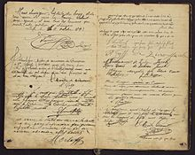

# Title: PHP Guestbook

- Repository: `challenge-php-guestbook`
- Type of Challenge: `Consolidation Challenge`
- Duration: `1 day`
- Deployment strategy : `NA`
- Team challenge : `solo`

## Learning objectives
- Storing data in files
- Converting complex constructs (array/objects) to string representation.
- Deliver a project under a strict deadline

## The Mission
It is time for our first php Consolidation challenge!
Let's remember the internet of the 1990, and create a classic widget that every site in that decade had: a guestbook. 

Any visitor on te page can leave a message on your page that are then saved and showed (last message on top) for everybody who visits the page.

### How to store the messages?
You can store the messages in a file on your system. You can use the brother of [file_get_contents()](https://php.net/file_get_contents) for this: [file_put_contents()](https://php.net/file_put_contents) .

You can either use [json_encode()](https://php.net/json_encode) or [serialize()](https://php.net/serialize) to convert your array to a string to store.

## Must-have features
- Posts must have the following attributes:
    * Title
    * Date
    * Content
    * Author name
    
- Use at least 2 classes: PostLoader & Post
- The messages are sorted from new (top) to old (bottom).
- Make sure the script can handle [site defacement attacks](https://en.wikipedia.org/wiki/Website_defacement): use [htmlspecialchars()](https://www.php.net/htmlspecialchars)
- Only show the latest 20 posts.

## Nice to have features
- Profanity filter: at the top of your script create an array of "bad" words. If somebody tries to enter a message with those words, their messages gets rejected.

- When the user enters uses a "smily" like ":-)", ";-)", ":-(" replace it with an image of such a smily.

- Have an input field where the user can enter how many message he wants to see displayed.

### Tips & Advice
- To keep a good overview of the code we recommend separating the view (html code) as much as possible from the PHP code, look at the example.php.
If you want you can already look into [more advanced theory](https://nl.wikipedia.org/wiki/Model-view-controller-model) for this separation, but it is not required in this exercise.

- Write your footer and header HTML code and `require()` them in your template files in separate files to avoid repeating HTML code.
