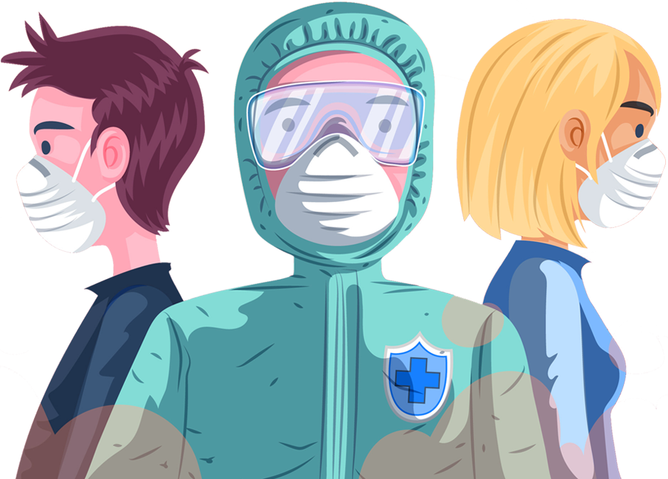
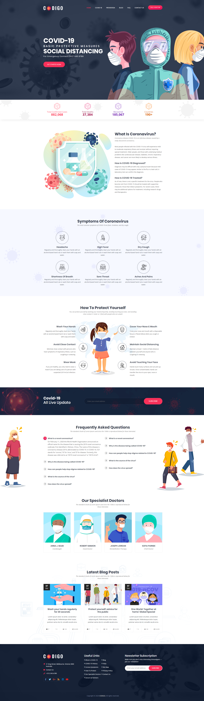

# The Corona challenge
|Challenge Parameters  |Challenge Details              |
|:---------------------|:------------------------------|
|Repository            |`Corona challenge`             |
|Challenge type        |`Bonus challenge`              |
|Duration              |`N/A`                          |
|Deadline              |`N/A`                          |
|Deployment method     |`Github page`                  |
|Group composition     |`solo`                         |

## Learning objectives
- Improve your Bootstrap knowledge.
- Improve your Sass knowledge.
- Learn to use Bootstrap's sass files (**NOT THE CSS FILES**).
- Use advanced CSS techniques.  

## BONUS Learning objectives
- Improve your JS knowledge.
- Make use of the [Covid19 API](https://covid19api.com/).
- Make us of a JS Libary that visualises the data collected from the API. (Example: [chart.js](https://www.chartjs.org/)).

## Welcome junior web developer!

#### You're just in time! We're in a crisis!
As you know, there's an invisible enemy in our midst.  
(No, we're not talking about the spy.)  
Corona is an existing insurance company, beer, but also a deadly virus.

The latter is important right now!  
The citizens are in need of a website where they can find all kinds of information about the virus.
Your job is to create it with an existing design that we'll present to you.

    

## The design

Before we dive into details take a good look at the [design](Corona-home.png).  
All the resources you need are located in the [images](images/) folder.

    
 Show design

    

## Rules

There are a couple of rules though, limits to test yourself and improve yourself as an developer.  

#### Don't cheat yourself.
We'll give you a link to a working demo. This so you can view and study the effects on the website.  
Whatever you do, try to **avoid** the inspector at **all times**.

You don't learn anything by copying things. So don't cheat yourself.  
On the contrary, use google just like a real developer!

#### Use the bootstrap Scss files
Download and only use what you really need. Import the files as partials (Instructions are on the bootstrap website.)
Change the pre-written values in those files to your needs. You will notice how flexible bootstrap can be!

#### Use Sass
Well... you already guessed that.

#### Get as close as possible to the example website
[This website](https://covid.presstigers.dev/) only uses free sources, available on the internet. If you are not sure about the fonts, you are allowed to look it up in the inspector!

### Good luck! You will help many people by doing this.

    

## Bonus

You are finished? You are looking for more challenges? Great!

## JavaScript related

### Challenge 1 - Data fetching:
- Make use of the [Covid19 API](https://covid19api.com/), as a start only fetch data of belgium.

### Challenge 2 - Data usage:
- Use DOM manipulation to insert the data fetched on this date *20-05-2020*, display it somewhere on the website.

### Challenge 3 - Data visualisation:
- Well done! The next step will be to show our data inside some kind of graph. Take your time to discover the libary you have chosen.(like [chart.js](https://www.chartjs.org/))  
Use a graphic that you think works well with the data and setting.

### Challenge 4 - Data picky fetch:
- Try to find a way to select the date. If there is not data available for that date, display an error message.

### Challenge 5 - Data pickier fetch:
- Try to find a way to select the country inside a menu. Best practice, make a input field which can take the users input.
For example: "en" would show only countries that include "en" in their name.

### Challenge 6 - Style this section:
- Give this section a nicer spot somewhere on the website, try to style it! (It must fit in our given design.)

## CSS related

- Create the other pages!

### Well done!

